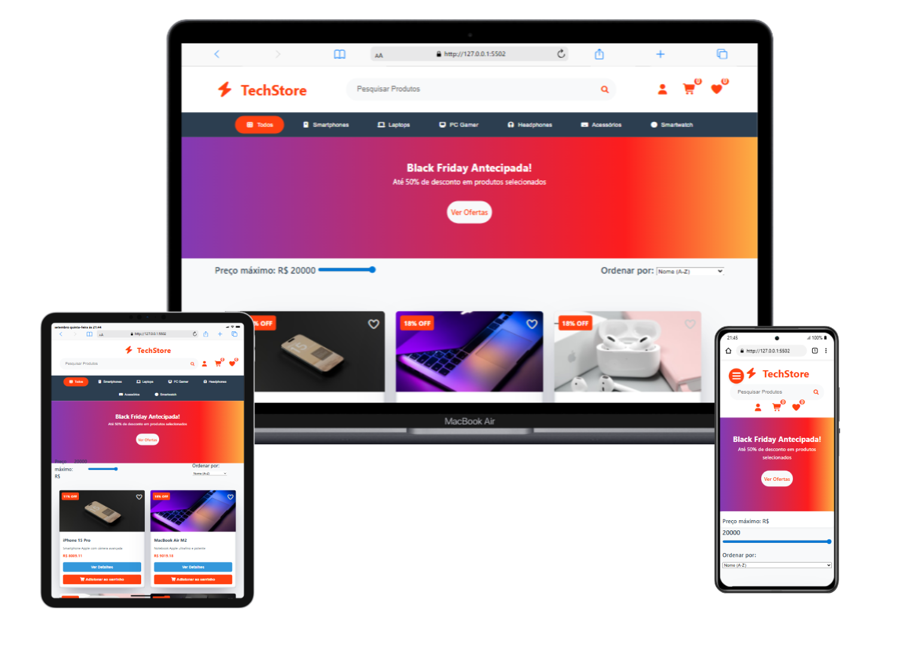

<h1> TechStore e-commerce</h1>
<h2> Projeto iniciado no bootcamp do DevClub com prof: Rodolfo Mori</h2>

## Table of contents
- [Overview](#overview)
- [Description](#description)
- [Screenshot](#screenshot)
- [My process](#my-process)
- [Site Link](#site-link)
- [Author](#author)

## Description
Concretizando o E-commerce TechStor
As aulas do DevClub foram fundamentais para a concretização do meu projeto TechStor, um e-commerce desenvolvido com HTML, CSS e JavaScript. Com dedicação e esforço, pude aplicar os conhecimentos adquiridos e ir além, criando uma plataforma robusta e focada na experiência do usuário.

A conclusão do TechStor representa um marco na minha evolução. É gratificante ver como o estudo dos materiais de aula e a pesquisa em documentações no Google se traduziram em funcionalidades concretas, como:

Design e Produtos: Nova paleta de cores, categorias e produtos, com a possibilidade de visualizar mais fotos diretamente nos cards.

Interação com o Usuário: Um sistema de login e cadastro com salvamento no navegador, e uma função de "curtir" que permite salvar produtos favoritos.

Este projeto não é apenas um código, mas a prova do meu comprometimento em aprender e evoluir. A cada desafio superado, sinto-me mais preparado para buscar novos conhecimentos e me aprofundar no mundo do desenvolvimento.

## Screenshot

## My process
- HTML
- CSS
- JAVASCRIPT

<h2> Planejamento, Estilização e Responsividade (HTML, CSS)</h2>
Iniciei pela estruturação da página em HTML, criando a base para o e-commerce. Em seguida, 
utilizei CSS para estilizar a interface, implementando uma nova paleta de cores e aprimorando o design. 
A criação de cards de produtos com a opção de visualizar mais fotos foi um passo crucial para enriquecer a experiência visual.

<h2>Funcionalidades, Interatividade e Dinamismo (JavaScript)</h2>
Com a estrutura e o design definidos, dediquei-me à lógica em JavaScript. Desenvolvi um sistema de login e cadastro que salva os dados no navegador, 
proporcionando uma experiência contínua para o usuário.
A função de "curtir" produtos foi implementada para permitir que os usuários salvem seus itens favoritos, reforçando o foco na usabilidade.

## Site Link
- https://techstore-e-commerce.netlify.app/

## Author
- Front-end developer: "Vander Luís".
